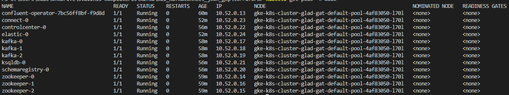
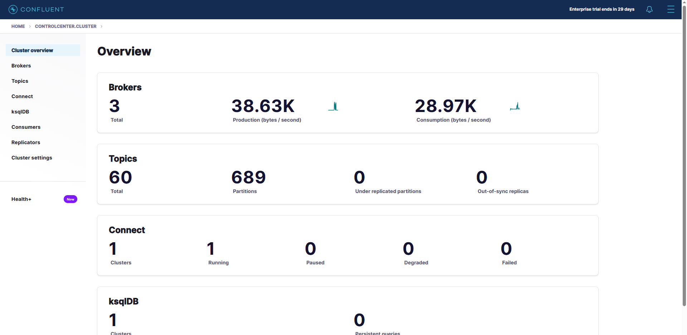
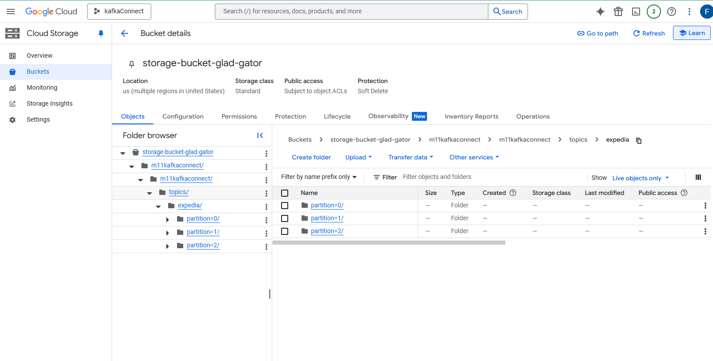
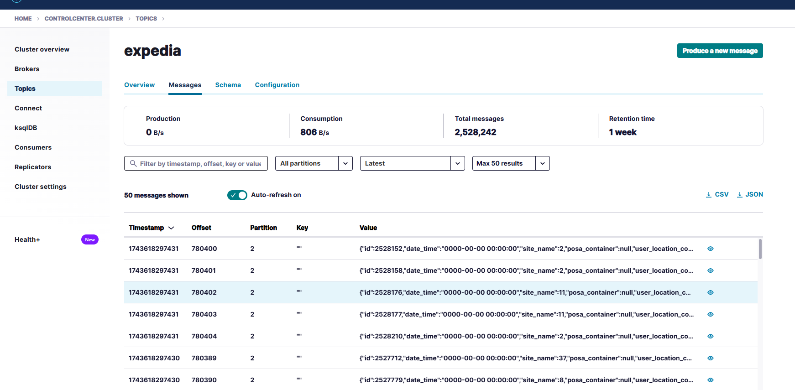

# Kafka Connect with GCP Integration

## 1. Create your own project on GCP

I created an account with free trial on gcp

## 2. Install Google Cloud CLI (gcloud & gsutil), Kubernetes controls (kubectl) and spark on your host machine.

Installed everything

## 3. Use gcloud auth login && gcloud auth application-default login && gcloud config set project [PROJECT] to initialize access to your project.

Setup everything

## 4. Run terraform init && terraform apply. Provide your project ID and already existing bucket for Terraform state. Terraform script will create a K8S cluster, a GCS bucket and a service account with RW permission for the bucket.

1. Navigate to the `terraform` folder.
2. Run the following commands:
    ```bash
    terraform init
    terraform apply
    ```

## 5. Run gcloud container clusters get-credentials [CLUSTER_NAME] --zone [CLUSTER_ZONE] --project [PROJECT] to configure kubectl to work with your k8s cluster.  

Ran the commands

## 6. Create a namespace

Create the namespace to use:
```bash
kubectl create namespace confluent
```

Set this namespace to default for your Kubernetes context:
```bash
kubectl config set-context --current --namespace confluent
```

## 7. Install Confluent for Kubernetes

Add the Confluent for Kubernetes Helm repository:
```bash
helm repo add confluentinc https://packages.confluent.io/helm
helm repo update
```

Install Confluent for Kubernetes:
```bash
helm upgrade --install confluent-operator confluentinc/confluent-for-kubernetes
```

## 8. Create your own connector's image

I created and pushed the image with these commands:
```bash
docker build -t kafkatraining:latest .
docker push edgarasdir/kafkatraining:latest
```

## 9. Install Confluent Platform

Before applying this file I modified it:
```bash
application: edgarasdir/kafkatraining:latest
```

Install all Confluent Platform components:
```bash
kubectl apply -f ./confluent-platform.yaml
```

Install a sample producer app and topic:
```bash
kubectl apply -f ./producer-app-data.yaml
```

Check that everything is deployed:
```bash
kubectl get pods -o wide 
```



## 10. View Control Center

Set up port forwarding to Control Center web UI from local machine:
```bash
kubectl port-forward controlcenter-0 9021:9021
```

Browse to Control Center: http://localhost:9021 



## 11. Create a kafka topic

Create a connection for kafka:
```bash
kubectl port-forward connect-0 8083:8083
```

for Windows OS run the additional command:
```bash
Remove-item alias:curl
```

execute below command to create Kafka topic with a name 'expedia'
```bash
kubectl exec kafka-0 -c kafka -- bash -c "/usr/bin/kafka-topics --create --topic expedia --replication-factor 3 --partitions 3 --bootstrap-server kafka:9092"
```

## 12. Upload files to GCP

I just dragged and droped the files to the GCP bucket:



## 13. Prepare the GCP connector configuration file

I modified the config file and masked the date_time field:
```json
{
  "name": "expedia",
  "config": {
    "connector.class": "GcsSource",
    "kafka.auth.mode": "SERVICE_ACCOUNT",
    "format.class": "io.confluent.connect.gcs.format.avro.AvroFormat",
    "gcs.credentials.json": "",
    "gcs.bucket.name": "storage-bucket-glad-gator",
    "topics.dir": "m11kafkaconnect/m11kafkaconnect/topics/expedia/",
    "tasks.max": "1",
    "transforms": "MaskTime",
    "transforms.MaskTime.type": "org.apache.kafka.connect.transforms.MaskField$Value",
    "transforms.MaskTime.fields": "date_time",
    "transforms.MaskTime.replacement": "0000-00-00 00:00:00"
  }
}
```

## 14. Upload the connector file through the API

I uploaded the file and successfully made a connection:

```bash
curl -s -X POST -H "Content-Type:application/json" --data @gcp-source.json http://localhost:8083/connectors
```

